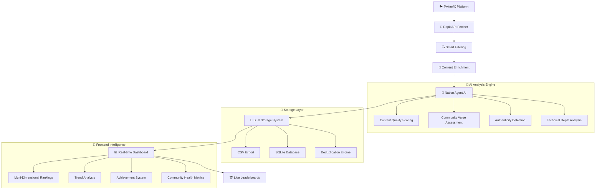

# 🎯 Nation Radar

A sophisticated AI-powered social media monitoring system for tracking and analyzing Crestal Network community content. Features real-time tweet collection, Nation Agent AI scoring, and dynamic leaderboards.

  

## ✨ Features

- 🤖 **AI-Powered Scoring** - Uses Crestal Nation Agent for sophisticated content analysis
- 🏆 **Multi-Dimensional Leaderboards** - Overall excellence, rising stars, consistency champions
- 📊 **Real-time Analytics** - Community health insights and content intelligence
- 🌐 **Modern Web Dashboard** - Beautiful, responsive frontend interface
- 🔄 **Smart Deduplication** - Prevents re-processing of similar content
- 📈 **Engagement Enrichment** - Fetches comprehensive tweet metrics
- 🎯 **Ticker Focus** - Special handling for $NATION token mentions

## 🚀 Quick Start

### 1. Clone & Install
```bash
git clone https://github.com/yourusername/nation-radar.git
cd nation-radar
pip install -r requirements.txt
```

### 2. Configure Environment
```bash
cp .env.example .env
# Edit .env with your API keys:
# RAPIDAPI_KEY=your_rapidapi_key
# NATION_AGENT_API_KEY=your_nation_agent_key
```

### 3. Run the System
```bash
# Collect tweets and generate scores
python run_pipeline.py

# Start web dashboard
python app.py
# Visit: http://localhost:5000
```

## 🔥 How Nation Radar Works

Nation Radar operates as a sophisticated intelligence pipeline that transforms raw social media data into actionable community insights through AI-powered analysis.

### 🎯 **The Intelligence Pipeline**



### ⚡ **Step-by-Step Intelligence Flow**

#### **🔄 Phase 1: Intelligent Data Collection**
```python
# 1. Smart Keyword Targeting
keywords = ["Crestal", "$NATION", "@crestalnetwork", "Nation.fun"]

# 2. Time-Bounded Fetching
tweets = fetcher.fetch_with_temporal_context(days_lookback=7)

# 3. Advanced Filtering
filtered_tweets = apply_regex_filters(tweets, project_patterns)
```

**What happens:**
- 🎯 **Precision Targeting**: Monitors specific Crestal ecosystem keywords
- ⏰ **Temporal Intelligence**: Fetches recent content within configurable timeframes  
- 🔍 **Smart Filtering**: Eliminates noise using regex patterns and false-positive detection
- 🚫 **Duplicate Prevention**: Content-hash based deduplication prevents reprocessing

#### **🤖 Phase 2: AI-Powered Quality Analysis**
```python
# 4. Content Preparation
formatted_content = format_for_agent(tweet_text + engagement_metrics)

# 5. Nation Agent Analysis
score = crestal_nation_agent.analyze(formatted_content)
# Returns: Sophisticated 0.0-2.0 quality score
```

**The AI evaluates:**
- 📝 **Content Substance**: Real insights vs. superficial hype
- 🏗️ **Technical Depth**: Understanding of Crestal ecosystem mechanics
- 🤝 **Community Value**: Helpfulness to other $NATION holders
- 🎯 **Authenticity**: Genuine contribution vs. engagement farming
- 💡 **Innovation Factor**: Introduction of new ideas or solutions

#### **💾 Phase 3: Intelligent Storage & Indexing**
```python
# 6. Multi-Layer Storage
if sqlite_storage.append_row(tweet):  # Primary storage with constraints
    csv_storage.append_row(tweet)     # Human-readable export
    update_search_index(tweet)        # Fast retrieval optimization
```

**Storage intelligence:**
- 🗄️ **SQLite Primary**: ACID compliance, complex queries, relationship mapping
- 📄 **CSV Export**: Human-readable format for external analysis
- 🔗 **Cross-Reference**: Links tweets to user profiles and historical data
- 🧠 **Smart Indexing**: Optimized for leaderboard calculations and trend analysis

#### **📊 Phase 4: Real-Time Analytics Engine**
```python
# 7. Multi-Dimensional Analysis
leaderboards = {
    'overall_excellence': rank_by_average_score(),
    'rising_stars': detect_improvement_trends(),
    'consistency_champions': analyze_reliability_patterns(),
    'community_impact': measure_engagement_quality()
}
```

**Analytics capabilities:**
- 🏆 **Dynamic Rankings**: Real-time leaderboard updates as new content arrives
- 📈 **Trend Detection**: Identifies emerging contributors and topic patterns
- 🎯 **Performance Metrics**: Tracks user improvement trajectories over time
- 🌡️ **Community Health**: Monitors overall ecosystem content quality

#### **🎨 Phase 5: Interactive Intelligence Dashboard**
```javascript
// 8. Live Frontend Updates
dashboard.renderLeaderboards(enhanced_analytics);
dashboard.updateCommunityPulse(health_metrics);
dashboard.highlightTrends(emerging_patterns);
```

**Dashboard features:**
- 🔄 **Real-Time Updates**: Live data refresh without page reload
- 🎭 **Multi-View Interface**: Switch between different ranking perspectives
- 📱 **Responsive Design**: Perfect experience across all devices
- 🎨 **Interactive Elements**: Click-through user profiles and tweet analysis

### 🧠 **Advanced Intelligence Features**

#### **🔮 Predictive Analytics**
- **Trend Forecasting**: Predicts which topics will gain traction
- **User Trajectory**: Estimates future performance based on historical patterns
- **Content Optimization**: Suggests improvements for better scoring

#### **🛡️ Quality Assurance**
- **Anti-Gaming**: Detects and prevents system manipulation attempts
- **Content Authenticity**: Identifies genuine vs. manufactured engagement
- **Bias Detection**: Ensures fair scoring across different content types

#### **🌐 Ecosystem Intelligence**
- **Cross-Platform Correlation**: (Future) Links Twitter activity to Discord/Telegram
- **Market Impact Analysis**: (Future) Correlates content quality with $NATION price
- **Developer Activity Tracking**: (Future) Monitors GitHub contributions

### 💡 **Why This Architecture Is Powerful**

**🎯 Distributed Intelligence**: Each component specializes in one aspect of the analysis
**⚡ Performance Optimized**: Async processing and smart caching minimize latency  
**🔧 Highly Extensible**: Modular design allows easy addition of new features
**🛡️ Production Ready**: Comprehensive error handling and fallback mechanisms
**📈 Scalable**: Designed to handle growing Crestal community data volumes

---

*Nation Radar doesn't just track mentions - it understands the pulse of the Crestal ecosystem through sophisticated AI analysis.*

## 🎯 Key Components

### Core Pipeline (`run_pipeline.py`)
- Automated tweet collection for Crestal keywords
- Integration with Nation Agent AI scoring
- Smart deduplication and data persistence

### Web Dashboard (`app.py`)
- Flask-based API and frontend server
- Real-time leaderboards and analytics
- RESTful endpoints for data access

### Enhanced Analytics (`enhancements/`)
- Multi-dimensional ranking systems
- User trend analysis and achievements
- Community health insights

## 🌐 Deployment Options

### Local Development
```bash
python run_pipeline.py  # Manual run
python app.py           # Web dashboard
```

### 24/7 VPS Deployment
```bash
cd deployments/
./deploy_vps.sh         # Automated VPS setup
./start_monitoring.sh   # Start 24/7 monitoring
```

### Vercel (Serverless)
```bash
cd deployments/
# Deploy to Vercel for global edge hosting
# See VERCEL_DEPLOYMENT_GUIDE.md
```

## 📁 Project Structure

```
crestal-monitor/
├── 🎯 Core System
│   ├── run_pipeline.py      # Main pipeline execution
│   ├── app.py              # Web dashboard & API
│   ├── nation_agent.py     # Crestal AI integration
│   ├── config.py           # Configuration management
│   └── config.yaml         # Keywords & settings
├── 📦 Modules
│   ├── fetchers/           # Tweet data sources
│   ├── storage/            # Data persistence
│   ├── filters/            # Content filtering
│   └── frontend/           # Web interface
├── 🚀 Deployments
│   ├── deployments/        # VPS & cloud deployment
│   └── enhancements/       # Advanced features
├── 📊 Data & Testing
│   ├── data/              # CSV files & databases
│   ├── tests/             # Unit tests
│   └── docs/              # Documentation
└── 📋 Config
    ├── requirements.txt    # Python dependencies
    ├── .env.example       # Environment template
    └── README.md          # This file
```

## 🎨 Screenshots

### Multi-Dimensional Leaderboards
- 🏆 **Overall Excellence** - Top contributors by average score
- 🚀 **Rising Stars** - Users with biggest improvements  
- 💎 **Consistency Champions** - Most reliable contributors
- 📊 **Community Insights** - Health metrics and trends

### Analytics Dashboard
- Real-time community health metrics
- Content performance insights
- User achievement tracking
- Trend analysis and predictions

## 🛠️ Configuration

### Keywords (config.yaml)
```yaml
keywords:
  - Crestal
  - Crestal Network
  - $NATION
  - "@crestalnetwork"
days_lookback: 7
csv_filename: groktweets.csv
```

### Environment Variables (.env)
```bash
# Required API Keys
RAPIDAPI_KEY=your_rapidapi_key
NATION_AGENT_API_KEY=your_nation_agent_key

# Optional Settings
DEBUG_MODE=False
DAYS_LOOKBACK=7
```

## 🔧 API Endpoints

- `GET /api/crestal-data` - All tweet data with scores
- `GET /api/leaderboard` - Top contributors ranking  
- `GET /api/enhanced-leaderboards` - Multi-dimensional rankings
- `POST /api/test-scorer` - Test Nation Agent scoring
- `GET /api/system-status` - System health check

## 📈 Enhancements Available

- **Achievement System** - Gamified user milestones
- **Content Intelligence** - What makes content score well
- **User Journey Tracking** - Progress visualization
- **Predictive Analytics** - AI-powered insights
- **Multi-Platform Support** - Discord, Telegram integration

## 🤝 Contributing

1. Fork the repository
2. Create feature branch (`git checkout -b feature/amazing-feature`)
3. Commit changes (`git commit -m 'Add amazing feature'`)
4. Push to branch (`git push origin feature/amazing-feature`)
5. Open a Pull Request

## 📄 License

This project is licensed under the MIT License - see the [LICENSE](LICENSE) file for details.

## 🙏 Acknowledgments

- **Crestal Network** - For the sophisticated Nation Agent AI
- **Ryan's Twitter API** - For reliable tweet data access
- **Open Source Community** - For the tools and libraries

## 📞 Support

- 🐛 **Issues**: [GitHub Issues](https://github.com/yourusername/crestal-monitor/issues)
- 💬 **Discussions**: [GitHub Discussions](https://github.com/yourusername/crestal-monitor/discussions)
- 🚀 **Deployments**: See `deployments/` folder for guides

---

**Built with ❤️ for the Crestal Community**

*Focused on quality content identification and community intelligence in the Web3 space.*